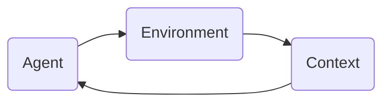

# Agentic Loop Protocol

Agentic Loop Protocol (ALP) 是一种可运行的、模块化的、可拓展的智能体交互协议。ALP定义了智能体和自己、环境以及其他智能体之间的交互规则和运行流程。

ALP基于以下AgenticLoop范式，实现智能体运行和交互：

此范式支持当前智能体框架中的大部分功能模块，包括：
- 规划
- 状态跟踪
- 环境交互
- 多智能体协作
- 记忆管理
- 反思
- ...

## Development 开发指南

### 1. 开发管理工具
本项目使用 [uv](https://github.com/astral-sh/uv) 管理环境依赖，使用 [git flow](https://github.com/nvie/git-flow) 管理开发版本

### 2. 开发计划
Development Roadmap

- [ ] 定义基类和接口
    - [ ] 数据类和持久化接口
    - [ ] 日志类
    - [ ] Environment 基类接口
    - [ ] Agent 基类接口
    - [ ] Context 基类接口

- [ ] MVP - 复现 Mobile-Agent-v3